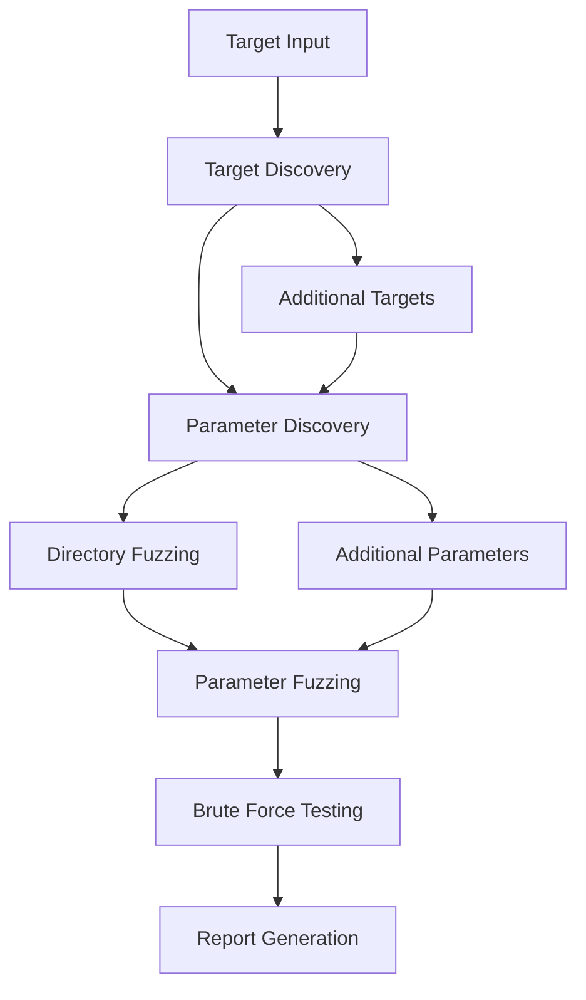

# Judgement - Ultimate Security Testing Framework

<div align="center">


**Professional Penetration Testing Automation with Intelligent Chaining**

[Installation](#-installation) • [Quick Start](#-quick-start) • [Features](#-key-features) • [Documentation](#-documentation) • [Support](#-support)

</div>

---

## 🚀 Overview

Judgement is a comprehensive, enterprise-grade penetration testing automation framework designed for professional security assessments. It features intelligent chaining of multiple attack vectors, automated vulnerability discovery, and professional reporting capabilities.

### 🎯 What Makes Judgement Unique

- **🧠 Intelligent Chaining**: Automatically chains discovery → enumeration → exploitation
- **⚡ High Performance**: Multi-threaded operations with configurable concurrency
- **📊 Professional Reporting**: Enterprise-ready HTML and JSON reports
- **🔧 Highly Configurable**: 4 scan depths from quick reconnaissance to thorough audits
- **🛡️ Security-First**: Built-in authorization checks and ethical use enforcement

## ✨ Key Features

| Feature | Description | Capability |
|---------|-------------|------------|
| 🎯 **Intelligent Target Discovery** | Automated discovery and analysis of attack surfaces | Link extraction, subdomain enumeration, asset correlation |
| 🔍 **Parameter Discovery** | Advanced parameter mining and analysis | URL analysis, form parsing, method-specific discovery |
| 📁 **Directory Fuzzing** | Comprehensive web directory and file discovery | 53 common directories + extensions, intelligent analysis |
| ⚡ **Parameter Fuzzing** | Multi-payload vulnerability testing | 896+ payloads across 12 attack vectors |
| 🔓 **Brute Force Testing** | Intelligent login form detection and credential testing | Smart form detection, 252 credential combinations |
| 🧠 **Full Intelligent Assessment** | Orchestrated multi-phase security assessment | Complete automated workflow |
| 📊 **Professional Reporting** | HTML and JSON reports with vulnerability details | Executive summaries, detailed findings, evidence |
| 🗄️ **Database Storage** | SQLite backend for persistent finding storage | Thread-safe operations, relationship tracking |
| 🎨 **Rich CLI Interface** | Professional terminal UI with progress tracking | Real-time updates, color-coded output |
| ⚙️ **Configurable Depth** | Quick, normal, deep, and thorough scan modes | Adaptive payload selection and timing |
| 🚀 **Multi-threaded** | High-performance concurrent operations | Up to 100 configurable worker threads |

## 📊 Payload Arsenal

Judgement includes **896 professional-grade payloads** across 12 vulnerability categories:

| Category | Count | Examples |
|----------|-------|----------|
| 🗃️ SQL Injection | 75 | Union-based, Boolean-based, Time-based |
| 🔗 Cross-Site Scripting | 101 | Reflected, Stored, DOM-based |
| 💻 Command Injection | 149 | OS commands, Shell injection |
| 🎭 Server-Side Template Injection | 49 | Jinja2, Twig, Smarty |
| 📂 Path Traversal | 58 | Directory traversal, File inclusion |
| 🌐 XML External Entity | 42 | XXE attacks, XML bombs |
| 🔄 Server-Side Request Forgery | 94 | Internal service access |
| 🏢 LDAP Injection | 30 | LDAP query manipulation |
| 📊 NoSQL Injection | 23 | MongoDB, CouchDB attacks |
| 🔍 XPath Injection | 62 | XPath query manipulation |
| 📨 CRLF Injection | 52 | HTTP response splitting |
| 📋 HTTP Header Injection | 61 | Header manipulation attacks |

## 🛠️ Installation

### Prerequisites

- **Python 3.8+** (3.8+ recommended for best performance)
- **pip** package manager
- **100MB+ free disk space**
- **Network connectivity** (for SecLists integration)

### 🚀 Quick Installation

```bash
# Clone the repository
git clone https://github.com/cxb3rf1lth/Judgement.git
cd Judgement

# Run automated setup (recommended)
chmod +x setup.sh
./setup.sh

# Manual installation
pip install -r requirements.txt
python3 Judgement.py
```

### 🔧 Development Installation

```bash
# Install with development dependencies
pip install -r requirements-dev.txt

# Enable pre-commit hooks (optional)
pre-commit install
```

### 🐳 Docker Installation (Coming Soon)

```bash
# Build and run with Docker
docker build -t judgement .
docker run -it --rm judgement
```

## 🚀 Quick Start

### Basic Usage

```bash
# Start the interactive interface
python3 Judgement.py

# Follow the prompts for authorized testing
# Select scan type and target
```

### Command Line Options (Future)

```bash
# Quick assessment
python3 Judgement.py --target https://example.com --depth quick

# Full assessment with custom threads
python3 Judgement.py --target https://example.com --depth thorough --threads 100

# Specific scan types
python3 Judgement.py --target https://example.com --scan-type directory,parameter
```

## 🎮 Usage Guide

### Interactive Menu System

When you start Judgement, you'll see a professional CLI interface with the following options:

```
┌─ Judgement Main Menu ────────────────────────────────────────┐
│ 1. Intelligent Target Discovery     │ Expand attack surface   │
│ 2. Parameter Discovery              │ Find hidden parameters  │
│ 3. Directory Fuzzing                │ Enumerate directories   │
│ 4. Parameter Fuzzing                │ Test for vulnerabilities│
│ 5. Brute Force Testing              │ Credential attacks      │
│ 6. Full Intelligent Assessment      │ Complete automation     │
│ 7. View Reports                     │ Access reports          │
│ 8. View Vulnerable Fields           │ Review findings         │
│ 9. Configuration                    │ Adjust settings         │
│ 10. Exit                            │ Clean shutdown          │
└──────────────────────────────────────────────────────────────┘
```

### Scan Depth Configuration

| Mode | Payloads | Duration | Use Case |
|------|----------|----------|----------|
| **Quick** | ~100 | 5-10 min | Initial reconnaissance |
| **Normal** | ~500 | 20-30 min | Standard assessment |
| **Deep** | ~1,500 | 1-2 hours | Comprehensive testing |
| **Thorough** | 896+ | 2-4 hours | Complete security audit |

### Configuration Options

Access the configuration menu (option 9) to customize:

- **🔧 Scan Depth**: quick, normal, deep, thorough
- **⚡ Thread Count**: 1-100 concurrent operations (default: 50)
- **⏱️ Timeout**: Request timeout in seconds (default: 20)
- **⏳ Delay**: Inter-request delay for rate limiting (default: 0.01s)
- **📄 Reporting Format**: HTML, JSON output formats
- **🌐 User Agent**: Custom user agent strings
- **🔐 Headers**: Additional HTTP headers

## 📋 Usage Examples

### Example 1: Quick Security Assessment

```bash
python3 Judgement.py
# Select: 6 (Full Intelligent Assessment)
# Target: https://testsite.example.com
# Depth: Quick
# Result: Complete scan in ~10 minutes
```

**What happens:**
1. 🎯 Target discovery finds additional endpoints
2. 🔍 Parameter discovery maps input points
3. 📁 Directory fuzzing finds hidden content
4. ⚡ Parameter testing with 100 key payloads
5. 📊 Professional report generation

### Example 2: Focused Directory Discovery

```bash
python3 Judgement.py
# Select: 3 (Directory Fuzzing)
# Target: https://company.example.com
# Discovers: /admin, /backup, /config, etc.
```

### Example 3: Parameter Vulnerability Testing

```bash
python3 Judgement.py
# Select: 4 (Parameter Fuzzing)
# Target: https://app.example.com/search?q=test&type=user
# Tests: SQL injection, XSS, command injection, etc.
```

### Example 4: Credential Testing

```bash
python3 Judgement.py
# Select: 5 (Brute Force Testing)
# Target: https://portal.example.com/login
# Tests: 252 common credential combinations
```

## 🎯 Core Components Deep Dive

### 1. **JudgementOrchestrator**
The brain of the framework that intelligently chains all security testing phases.

**Features:**
- Adaptive workflow based on discovered assets
- Intelligent payload selection
- Progress tracking and coordination
- Error handling and recovery

### 2. **IntelligentTargetDiscovery** 
Discovers additional targets through multiple vectors:

**Discovery Methods:**
- 🔗 Link extraction and analysis
- 🌐 Subdomain enumeration
- 📊 Related asset identification
- 🔍 Technology stack fingerprinting

### 3. **IntelligentParameterDiscovery**
Maps all input points in the target application:

**Discovery Techniques:**
- 📄 URL query analysis
- 📝 Form field extraction
- 🔧 Common parameter fuzzing
- 🌐 Method-specific parameter discovery (GET, POST, PUT, etc.)

### 4. **AdvancedFuzzer**
Multi-mode fuzzing engine with intelligent analysis:

**Fuzzing Modes:**
- 📁 Directory and file discovery
- ⚡ Parameter-based vulnerability testing
- 📎 Extension-based enumeration
- 📊 Status code and timing analysis

### 5. **PayloadGenerator**
Advanced payload system with SecLists integration:

**Payload Categories:**
- 💉 SQL Injection (Union, Boolean, Time-based)
- 🔗 Cross-Site Scripting (Reflected, Stored, DOM)
- 💻 Command Injection (OS, Shell commands)
- 🎭 Template Injection (Jinja2, Twig, Smarty)
- 📂 Path Traversal (LFI, RFI)
- 🌐 XXE (XML External Entity)
- 🔄 SSRF (Server-Side Request Forgery)
- And 5 more categories...

### 6. **DeepBruteForcer**
Intelligent credential testing system:

**Features:**
- 🎯 Automatic login form detection
- 📋 Smart wordlist management
- ⏱️ Rate limiting and evasion
- 🎯 Success pattern recognition

### 7. **ReportGenerator**
Professional reporting system:

**Report Types:**
- 📊 Executive summary reports
- 🔍 Detailed technical findings
- 📋 Vulnerability evidence
- 📈 Trend analysis
- 🏷️ Severity classification

### 8. **DatabaseManager**
SQLite-based persistence layer:

**Database Features:**
- 🔗 Relationship tracking
- 🔒 Thread-safe operations
- 📊 Query optimization
- 💾 Efficient storage

## 📊 Output & Reporting

### 🗂️ Generated Files Structure

```
Judgement/
├── 📊 reports/
│   ├── judgement_report_YYYYMMDD_HHMMSS.html    # Visual reports
│   ├── judgement_findings_YYYYMMDD_HHMMSS.json  # Machine-readable data
│   └── executive_summary_YYYYMMDD_HHMMSS.html   # Executive overview
├── 📝 logs/
│   ├── judgement_YYYYMMDD.log                   # Detailed execution logs
│   ├── error_YYYYMMDD.log                       # Error tracking
│   └── debug_YYYYMMDD.log                       # Debug information
├── 🗄️ Database
│   └── judgement.db                             # SQLite findings database
├── ⚡ payloads/
│   ├── sql_injection_payloads.txt               # Generated SQL payloads
│   ├── xss_payloads.txt                         # XSS test vectors
│   └── [category]_payloads.txt                  # Other payload categories
└── 📚 wordlists/
    ├── directories.txt                          # Directory wordlist
    ├── parameters.txt                           # Parameter wordlist
    └── credentials.txt                          # Credential combinations
```

### 📋 Report Contents

#### HTML Reports Include:
- 📈 **Executive Summary** with vulnerability metrics
- 🎯 **Target Overview** with discovered assets
- 🔍 **Detailed Findings** with severity ratings
- 💡 **Evidence Documentation** with payloads and responses
- 📊 **Risk Assessment** with CVSS scoring
- 🔧 **Remediation Guidance** for each finding
- 📅 **Scan Metadata** with timing and configuration

#### JSON Reports Include:
- 🤖 **Machine-readable data** for automation
- 📊 **Structured findings** with consistent schema
- 🔗 **Relationship mapping** between targets and findings
- ⏱️ **Timing information** for performance analysis
- 🎯 **Confidence scoring** for finding accuracy

## ⚠️ Legal & Ethical Use

<div align="center">

### 🚨 FOR AUTHORIZED SECURITY TESTING ONLY 🚨

</div>

Judgement is designed for legitimate security testing and must be used responsibly:

### ✅ Authorized Use Cases:
- 🏢 **Internal security assessments** on owned infrastructure
- 🤝 **Contracted penetration testing** with written authorization
- 🎓 **Educational purposes** in controlled lab environments
- 🔬 **Security research** on owned test systems
- 🛡️ **Defensive security** testing and validation

### ❌ Prohibited Activities:
- 🚫 **Unauthorized scanning** of systems you don't own
- 🏴‍☠️ **Malicious attacks** or system damage
- 📊 **Data theft** or privacy violations
- 🌐 **Network disruption** or denial of service
- ⚖️ **Any illegal activities** under applicable laws

### 📜 Legal Requirements:
1. **📝 Written authorization** from system owners
2. **📋 Scope agreement** defining testing boundaries
3. **🤝 Responsible disclosure** of discovered vulnerabilities
4. **⚖️ Compliance** with local and international laws
5. **🛡️ Data protection** and privacy considerations

### 🛡️ Built-in Safety Features:
- **✋ Authorization prompt** before every scan
- **⏱️ Rate limiting** to prevent system overload
- **📊 Non-destructive testing** methodology
- **🔒 Local data storage** only (no external transmission)
- **📝 Comprehensive logging** for audit trails

## 🔧 Technical Architecture

### 🏗️ System Requirements

| Component | Minimum | Recommended |
|-----------|---------|-------------|
| **Python** | 3.6+ | 3.8+ |
| **Memory** | 512MB | 2GB+ |
| **Storage** | 100MB | 1GB+ |
| **CPU** | 1 core | 4+ cores |
| **Network** | Basic connectivity | High bandwidth |

### 🧵 Threading Model

```python
# Configurable concurrency
DEFAULT_THREADS = 50        # Balanced performance
MAX_THREADS = 100          # Maximum allowed
MIN_THREADS = 1            # Single-threaded mode

# Thread-safe operations
Database: SQLite with connection pooling
Logging: Thread-safe file handlers
Progress: Rich library thread coordination
```

### 🗄️ Database Schema

```sql
-- Core scan management
CREATE TABLE scans (
    id INTEGER PRIMARY KEY,
    scan_id TEXT UNIQUE,
    target_url TEXT,
    scan_type TEXT,
    depth TEXT,
    start_time TIMESTAMP,
    end_time TIMESTAMP,
    status TEXT
);

-- Discovered targets
CREATE TABLE targets (
    id INTEGER PRIMARY KEY,
    scan_id TEXT,
    url TEXT,
    confidence REAL,
    discovery_method TEXT,
    FOREIGN KEY (scan_id) REFERENCES scans(scan_id)
);

-- Found parameters
CREATE TABLE parameters (
    id INTEGER PRIMARY KEY,
    scan_id TEXT,
    target_id INTEGER,
    name TEXT,
    type TEXT,
    method TEXT,
    confidence REAL,
    FOREIGN KEY (target_id) REFERENCES targets(id)
);

-- Vulnerability findings
CREATE TABLE findings (
    id INTEGER PRIMARY KEY,
    scan_id TEXT,
    target_id INTEGER,
    parameter_id INTEGER,
    vulnerability_type TEXT,
    severity TEXT,
    confidence REAL,
    payload TEXT,
    response_evidence TEXT,
    timestamp TIMESTAMP,
    FOREIGN KEY (target_id) REFERENCES targets(id),
    FOREIGN KEY (parameter_id) REFERENCES parameters(id)
);
```

## 🔍 Advanced Features

### 🌐 SecLists Integration

Judgement automatically integrates with SecLists for comprehensive wordlists:

```bash
# Automatic download and integration
SecLists Integration:
├── 📁 Directory wordlists: 53 common directories
├── 🔧 Parameter wordlists: Common web parameters  
├── 👤 Username wordlists: 18 common usernames
├── 🔑 Password wordlists: 14 common passwords
├── 🎯 Credential combinations: 252 pairs
└── 📚 Additional wordlists: 772 specialized entries

Total wordlist entries: 1,109
```

### 🎯 Intelligent Detection

Advanced vulnerability detection through multiple methods:

```python
# Detection Techniques
Content Analysis:     Pattern matching for vulnerability indicators
Timing Analysis:      Response time-based detection
Status Code Logic:    HTTP status code interpretation
Header Analysis:      Response header examination
Error Pattern Match:  Error message identification
Context Awareness:    Application context understanding
```

### 🔄 Multi-Phase Assessment

Intelligent workflow orchestration:



## 🚀 Performance Characteristics

### ⚡ Benchmark Results

| Scan Type | Small Target | Medium Target | Large Target |
|-----------|--------------|---------------|--------------|
| **Quick** | 2-5 min | 5-10 min | 10-15 min |
| **Normal** | 10-20 min | 20-40 min | 40-60 min |
| **Deep** | 30-60 min | 1-2 hours | 2-3 hours |
| **Thorough** | 1-2 hours | 2-4 hours | 4-6 hours |

### 📊 Resource Utilization

```python
# Memory Usage
Baseline:         ~50MB (framework overhead)
Per Thread:       ~2-5MB (request handling)
Database:         ~10-50MB (depending on findings)
Total Typical:    ~200-500MB

# Network Usage
Quick Scan:       ~1-10MB traffic
Normal Scan:      ~10-50MB traffic  
Deep Scan:        ~50-200MB traffic
Thorough Scan:    ~100-500MB traffic
```

## 🛠️ Development & Integration

### 🔧 Extending Judgement

#### Adding Custom Payloads

```python
# Add to PayloadGenerator class
def _generate_custom_payloads(self):
    return [
        "custom_payload_1",
        "custom_payload_2",
        # Add your payloads here
    ]
```

#### Custom Detection Rules

```python
# Add to AdvancedFuzzer class
def _custom_vulnerability_check(self, response, payload):
    # Implement custom detection logic
    if "custom_error_pattern" in response.text:
        return True
    return False
```

### 🔌 API Integration

#### JSON Export Format

```json
{
    "scan_metadata": {
        "scan_id": "assessment_20241018_143022",
        "target": "https://example.com",
        "depth": "normal",
        "start_time": "2024-10-18T14:30:22Z",
        "duration": 1847,
        "payloads_tested": 534
    },
    "findings": [
        {
            "id": 1,
            "type": "sql_injection",
            "severity": "high",
            "confidence": 0.95,
            "target": "https://example.com/search",
            "parameter": "q",
            "payload": "' OR 1=1--",
            "evidence": "SQL syntax error detected",
            "cvss_score": 8.1
        }
    ]
}
```

## 📚 Documentation

### 📖 Available Documentation

- **📋 README.md** - This comprehensive guide
- **🔧 TECHNICAL_ANALYSIS.md** - Complete technical documentation
- **⚙️ requirements.txt** - Core dependencies
- **🛠️ requirements-dev.txt** - Development dependencies
- **🚀 setup.sh** - Automated installation script

### 📞 Support

- **📧 Issues**: Submit via GitHub Issues
- **💬 Discussions**: GitHub Discussions for questions
- **📚 Wiki**: Detailed guides and tutorials
- **🔧 Contributing**: See CONTRIBUTING.md

### 🏷️ Version History

- **v5.0** - Current version with intelligent chaining
- **v4.x** - Enhanced payload system
- **v3.x** - Multi-threading support
- **v2.x** - Database integration
- **v1.x** - Initial release

---

<div align="center">

**Version**: 5.0  
**Maintained**: Active Development  
**License**: For Authorized Security Testing Only

[](https://github.com/cxb3rf1lth/Judgement/stargazers)
[](https://github.com/cxb3rf1lth/Judgement/network/members)

**⚡ Built for Security Professionals, by Security Professionals ⚡**

</div>